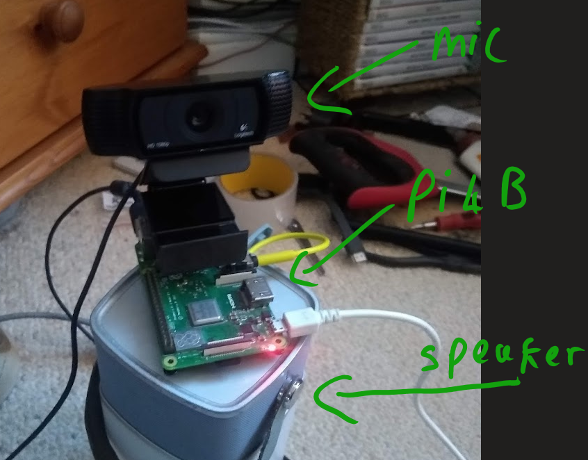
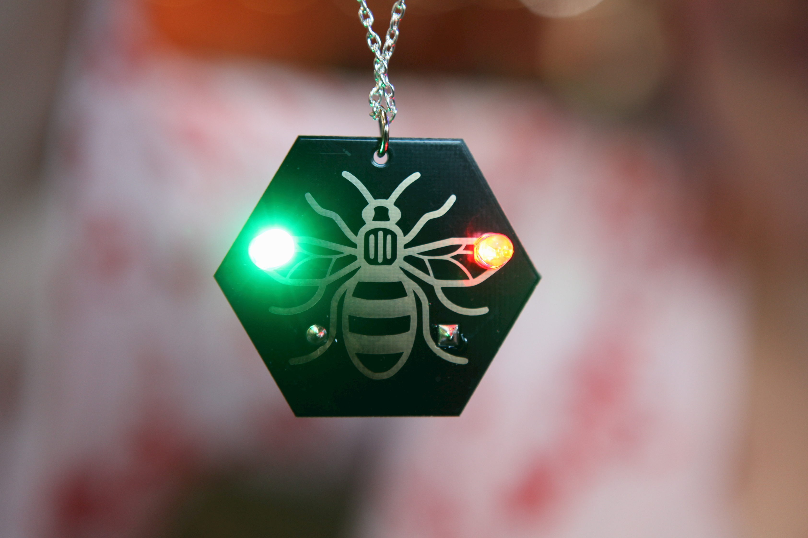
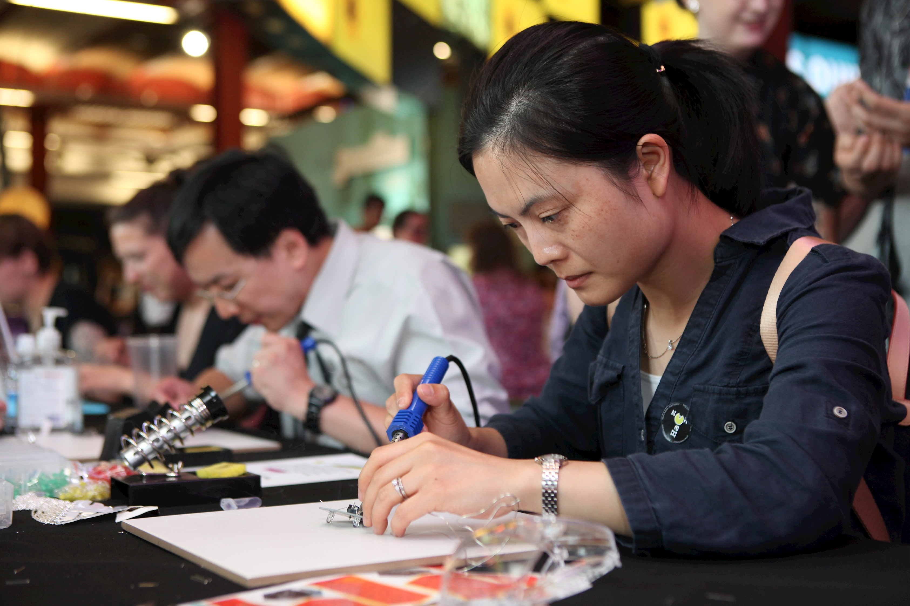
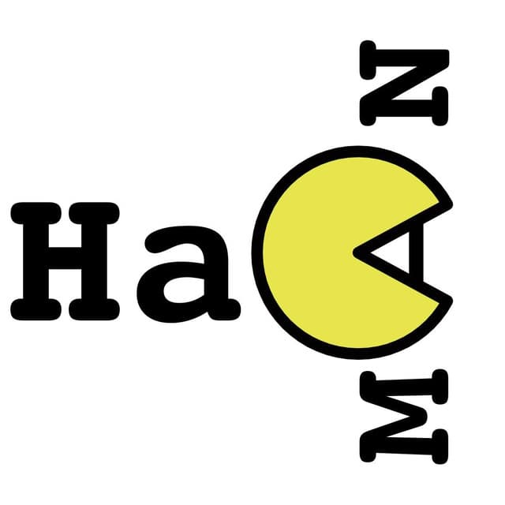
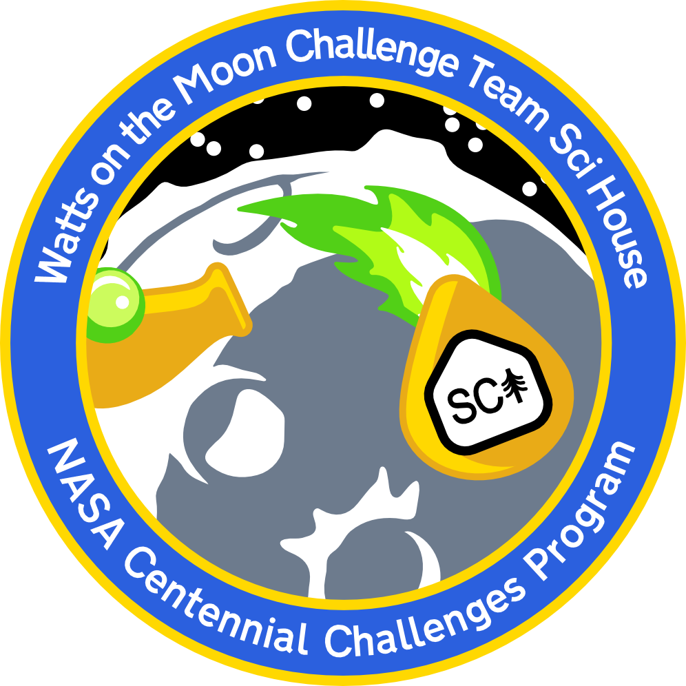

 

 	  

 # Scientist, Maker, Fabricator

Alex Bennett	Email:  info@alexmakes.net	

R&D Researcher developing novel solutions in engineering though materials science. 

### Experience

------

## [Scihouse Inc](https://www.scihouse.space/). Indiana, USA

#### R&D Researcher in Nacre bioreactors March ’21 - present

Devolving nacre like material with the aim to produce a range of economically viable products that fill the niche of carbon composites at a reduced ecological impact. 

#### R&D Lead Launchpad Dust Mitigation with Chitosan Biofoam and In Situ Resource March 2021 - March 2022

Lead researcher for Luna utilization of in situ resources with a aim to create solutions to luna habitation ,with pre-existing technologies that haven't seen use in aerospace to. decrease time needed for a minimal viable product.

#### Project lead HeroX Watts on the Moon Challenge, NASA Centennial Challenges Program  Jan 2021 - March 2022

Successfully Completed phase 1 as Project lead for “Gabriel Licina’s team” at the [NASA Centennial Challenges Program.](https://www.herox.com/NASAPrize) 

successfully filed a funding request to NASA for a proposed a solution to the watts on the moon challenge hosted by HeroX our solution  is meant to be simple and elegant with little waist and few moving parts. 

#### R&D Project lead Reduced cost Daytime Radiative cooling  June 2020 - present

 present Research a means of reducing the cost of the radiative cooling potential of low-cost metamaterial coatings as a means of utilising low quantity geothermal energy to provide power in unmaintained situations, as a competitor to current terrestrial Radioisotope thermoelectric generator technology but without the need for dangerous radiation sources. 

## [3D Crowd](https://www.3dcrowd.org.uk), Manchester ,United Kingdom 

#### Emergency PPE courier April - May 2020

During the pandemic, I helped the PPE shortage in the UK by providing a daily courier service shipping 3d printed PPE face shield parts from local makers by bicycle to the central hub in Manchester. Where they got assembled then sterilised. Before sent off to the front line at no cost. totalling 200,000 face shields 3D Printed and distributed. 

## Steam museum, Bolton ,United Kingdom 

 #### Museum Conservationist 2018 - 2020 
 My role is to service the museum exhibits, carry out routine maintenance. carry out part fabrication through a number of processes such as and not limited too, shaping, turning, grinding, milling for the many working steam engines that range in age from early Victorian to late 20th century on the show with notable engines belonging to the late Fred Dibnah. 
 #### Network Engineer 2018 - 2020
 My role is to service the computer systems the museum uses to store its archive. the fixing of interactive exhibits and service of the closed-circuit security system. providing their cybersecurity needs for GDPR compliance. 

### Publications

------

[A. Bennett and G. Licina, “Launchpad Dust Mitigation with Chitosan Biofoam and In Situ Resource.pdf,” Lunar Surface Innovation Consortium, Apr. 2021, p. 2, [Online].](https://www.zotero.org/60madethebestscience#MCMRH27P)

### Personal Projects

---

#### Open source IoT Smart home Jan 2020

I built a raspberry system that linked into the offline functionality of the Amazon Alexa’s to control equipment that wasn't officially supported

- built using JavaScript in Node.red to translate the Alexa API to the Roku media control API
- A web interface hosted on the Pi allowed for manual operation 
- This required the reverse engineering of the undocumented offline Alexa code and media controls of the Roku. 

see it working below.

<video src="../attachments/VID_20200129_225901367.mp4"></video>

#### Embedded Linux Hifi for 90’s Amp 2019

built a Hifi that can play songs hosted on a server via a Android app on a 90’s Yamaha hifi system, who says old kit can't rock

#### Home built Voice Assistant 2020 - present 

OpenHAB + **[Rhasspy](https://rhasspy.readthedocs.io/en/latest/)**

building from the  Smart home build from earlier in the year i managed to install a local voice assistant program called rhasspy and have manged to train it to my voice for the purpose of controlling the HiFi and Roku, the technology is lot of more complex than amazon’s Alexa api and will have to work on build more scripts to interface more devices 

### Community Projects

------

## Hackspace Manchester

I’ve run a local Hackspace for the past 5 years,

### PCBEE [sciencemuseum annual review:24-25](https://www.sciencemuseumgroup.org.uk/wp-content/uploads/2020/06/SMG_AR_2020_web_version.pdf)

A community outreach scheme too educate STEM subjects by hosting a number of workshops at the events such as Makefest Manchester and Maker Faire Newcastle.

 For this we desgined our own PCB badge, Used to teach the public basic soldring skils can build a LED badge in the shape of the Manchester’s worker bee.

## Historia Normannis 

#### Armourer stunt operator 2015 – present 

 For 6 years I’ve helped run a national historical re-enactment society as their armourer. responsibilities involve inspection of props and maintaining a high level of safety in battlefield equipment. fabrication and operation of stunt rigs for use in public events such as "Siege of Kenilworth" a high level of training passing an SAP (Stunt and pyrotechnics training) test it’s needed to operate a stunt rig correctly with the prime objective of spectator/actor safety within the stressful environments of a battlefield. 

 #### Human resources 2015 - 2016
 A democratically elected role whose first point of call for intergroup conflicts acting as an independent entity to provide neutral advice and support. providing the services of safeguarding members wellbeing. This is important as the battlefield is inherently a dangerous place to be and keeping it a safe place a level of trust needs to be maintained in all percipients to maintain the strict standards of safety through training and discipline that’s expected of us at events by our client’s. 

## Education

### Bolton University Greater Manchester, United Kingdom

BSc Computer Networks and Security 2:1 

- Enterprise Lan networks With a focus on Cisco Lab work
  - all hail the Cisco Router cli 
- Enterprise WAN and work from home VPN’s
- Switching networks architecture , Spanning tree , SNMP , Domains and VLAN’s
- Cyber Security
- Physical Security and Social Engineering Defence 
- Web design with a focus on backend software such as Node.js and PHP
- System administrator of Linux Systems 

Focussed on the design and implementation of enterprise computer networks such as the deployment of SNA mainframes in the banking sector as well as cybersecurity and penetration testing with Kali linux. 

### Offensive Security Certified Professional (OSCP) Late 2019

**on hiatus due to the pandemic forced closed of certification examination** 

#### Completed course material

- [x] Penetration Testing: What You Should Know
- [x] Getting Comfortable with Kali Linux
- [x] Command Line Fun
- [x] Practical Tools
- [x] Bash Scripting
- [x] Passive Information Gathering
- [x] Active Information Gathering
- [x] Vulnerability Scanning
- [x] Introduction to Buffer Overflows
- [x] Client-Side Attacks
- [x] File Transfers
- [x] Antivirus Evasion
- [x] Password Attacks
- [x] Port Redirection and Tunneling
- [x] The Metasploit Framework

## Kali Linux Certified Professional (KLCP) Late 2019

**on hiatus due to the pandemic forced closed of certification examination**

#### Completed course material 

- [x] About Kali Linux
- [x] Getting Started with Kali Linux
- [x] Linux Fundamentals
- [x] Installing Kali Linux
- [x] Configuring Kali Linux
- [x] Helping Yourself and Getting Help
- [x] Securing and Monitoring Kali Linux
- [x] Debian Package Management
- [x] Advanced Usage
- [x] Kali Linux in the Enterprise
- [x] Introduction to Security Assessments

### Professional Qualifications

- Cisco CCNA 2013

## Skills 

Practical specialties:  turret Milling, manual lathe, traditional carpentry and cabinet making, wood turning, 3d printing, CNC milling, vacume forming, costume design. prop design Technical specialties: Network design and implementation, with(in) a team. I love Python and play with regularly with Bash. Solid knowledge of Sytems administration , IoT Systems technologies: HTML+CSS, NodeRed,webhooks,Kali linux,OPSECLinux administration skills: bash, Apache, MySQL, virtualization VMware. 

## Interests 

playing the ocarina and have been for over 10 years, cycling and home cooking 

 		

This site doesn't track or store any of your information. I respect your right to privacy 
© 2021 Alex Bennett, All rights reserved.

